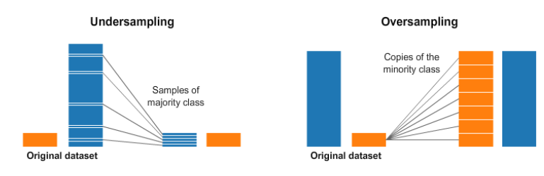
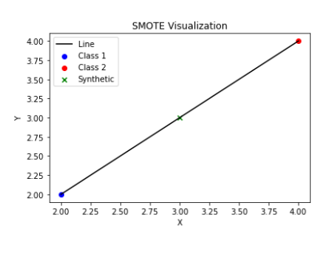
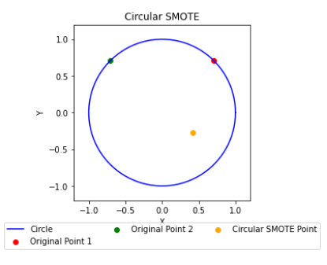
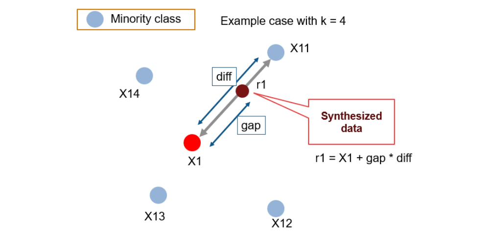

# Circular SMOTE

**Table of Contents**
1. [Overview of Imbalanced Data](#overview-of-imbalanced-data)
2. [Traditional Oversampling vs. SMOTE](#traditional-oversampling-vs-smote)
3. [How Circular SMOTE Differs](#how-circular-smote-differs)
4. [Detailed Example with k=4](#detailed-example-with-k4)
5. [Conclusion](#conclusion)

---

## Overview of Imbalanced Data

In many real-world classification problems, one class (the **majority class**) has far more samples than the other (the **minority class**). This imbalance can cause machine learning models to be biased toward predicting the majority class.

In the figure above:
- **Left**: An illustration of **undersampling**. We discard some majority samples to match the minority class size.
- **Right**: An illustration of **oversampling**. We duplicate (or synthesize) minority samples to increase their count.

Both methods aim to rebalance the dataset so that classifiers do not overlook the minority class.

---

## Traditional Oversampling vs. SMOTE

The simplest form of oversampling just duplicates existing minority samples. However, **SMOTE (Synthetic Minority Over-sampling Technique)** creates new synthetic samples by “interpolating” between existing minority points, which often provides more variety than just copying.

- **Green point**: A minority sample in Class 2.  
- **Red point**: Another minority sample in Class 2.  
- **Black line**: SMOTE creates synthetic samples (shown as X’s) along this line between two existing points.  

SMOTE typically improves performance compared to naive oversampling, but it may still produce synthetic points in a very linear fashion.

---

## How Circular SMOTE Differs

**Circular SMOTE** builds on SMOTE’s idea but **samples in a circular (or hyperspherical) region** rather than just the straight line between two points. Below is a simplified 2D illustration:

1. **Identify two existing minority samples** (shown in **green** and **red**).  
2. **Draw a circle** around them (blue circle) such that the circle’s center is halfway between these two points.  
3. **Randomly place a synthetic sample** (yellow dot) **anywhere inside that circle** rather than just on the line between them.

This approach can generate a **wider variety** of new samples, which may lead to better generalization by the model.

---

## Detailed Example with k=4

When using SMOTE-based methods, each minority sample typically selects one neighbor out of its \(k\)-nearest neighbors. Here’s a conceptual diagram of **k=4**:

- **X1** is our current minority sample.
- **X11**, **X12**, **X13**, and **X14** are the 4 nearest neighbors.
- Traditional SMOTE would create synthetic points along the arrows between X1 and one of its neighbors.
- **Circular SMOTE** uses the pair (X1, chosen neighbor) to define a circle (not shown in this simplified diagram) and randomly place new samples within that region.

By sampling in a circle instead of just on a line, **Circular SMOTE** can reduce clustering of synthetic samples and produce a more diverse minority class distribution.

---

## Conclusion

- **Traditional Oversampling** simply duplicates minority samples.  
- **SMOTE** improves on this by interpolating between neighbors to form new points.  
- **Circular SMOTE** goes a step further by sampling within a circular/hyperspherical region defined by two points, yielding more varied synthetic samples.

This visual approach helps you see why Circular SMOTE can improve classification performance on highly imbalanced datasets: it adds **synthetic minority samples** that are neither exact duplicates nor strictly on a line between existing samples, potentially providing more realistic coverage of the feature space.

For the **complete implementation** of Circular SMOTE (including code, dataset loading, and model evaluation), please see the accompanying scripts in this repository.

---

**Enjoy exploring Circular SMOTE, and feel free to contribute or open an issue if you have any questions!**
